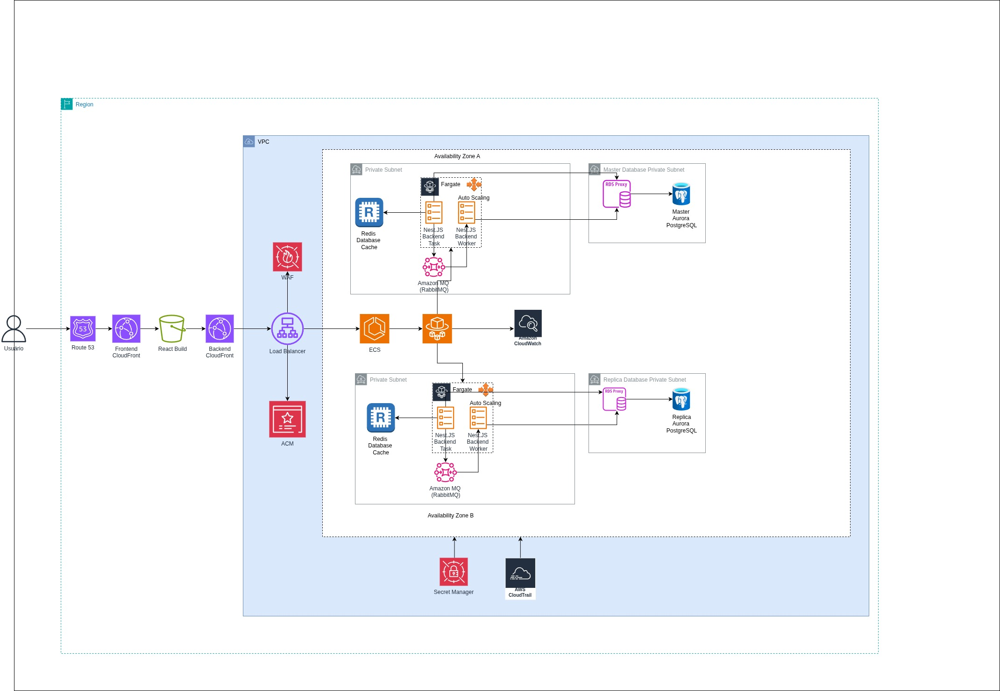
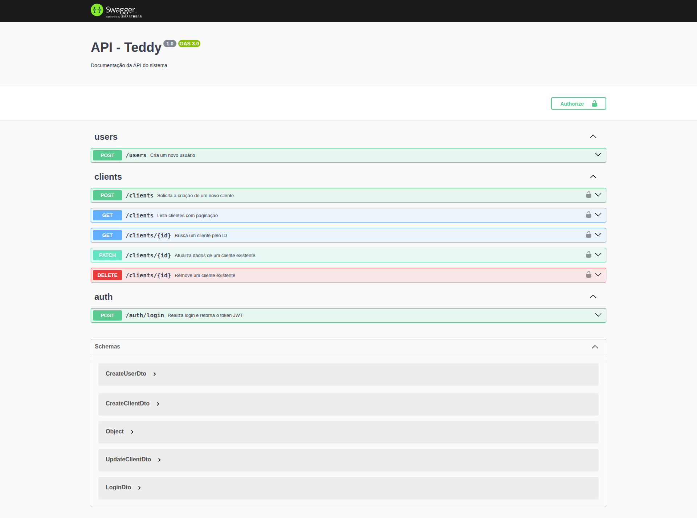

# Teste Tech Lead - Teddy Open Finance

A linha de raciocinio que eu segui nesse projeto, foi projetar um sistema resiliente, escalável, altamente disponível e de fácil manutenção.

Partindo dessa premissa, desenhei uma infraestrutura segura e robusta, capaz de aguentar milhões de acessos diarios, e que se manteria em pé mesmo diante de falhas em zonas de disponibilidade, como aconteceu recentemente na AWS.

O objetivo foi garantir continuidade do serviço, eficiência operacional e capacidade de evolução, assegurando que o sistema possa crescer de forma sustentável e sem comprometer a performance ou a estabilidade.

Eu montei um código terraform, disponivel em /terraform, para montar toda essa infra, nos ambientes: desenvolvimento, homologação e produção
e tambem montei um deploy simples, disponivel em workflow.

Já no código, no backend utilizei uma arquitetura em camadas, para separar Controller, service, e repository, isolando as responsabilidades.
Tambem usei um pouco de Event-Driven Architecture, para desacoplar as operações sincronas (HTTP) e assincronas (Worker), por isso vê duas tasks no desenho de arquitetura. De resto, tentei seguir as praticas recomendadas do Nest.JS. Usei tambem um sistema de cacheamento com Redis.

Frontend não é muito meu forte, mas tentei seguir algum padrão de arquitetura para facilitar a manutenção tambem.

Se eu fosse montar um backlog, seria:
-Colocar um lambda para rotacionar as senhas do secret manager, acionadas por um cron.
-Colocar alertas de falha ou sucesso no Frontend
-Corrigir um bug que está dando com o cache, tanto na criação quanto no cadastro.
-Criar paineis e alertas de erro no Grafana, em situações criticas talvez alertando o Tech Lead via WhatsApp
-Criar um loading mais amigavel e atraente no Frontend.
-Montar testes unitários, de integração, e de stress no backend
-Montar testes e2e, unitários e de componentes
-Melhorar o deploy para enviar para o ambiente de homologação quando a branch development for atualizada.
-Aplicação de gitflow

Swagger

Caso eu fosse fazer um painel administrativo nesse sistema, e partindo da premissa que é um painel administrativo apenas para controle dos usuários e seus clientes.
Eu pediria 1 semana com os seguintes desenvolvedores:
1 sênior full stack que será o pilar tecnico
1 pleno backend
1 pleno frontend

É muito para um sistema simples, mas é um tempo aceitavel de se negociar do ponto de vista de negocio, e poderiamos desenvolver com segurança, robustes, qualidade tecnica, e uma boa experiencia para o usuário, evitando dividas técnicas desde o inicio.